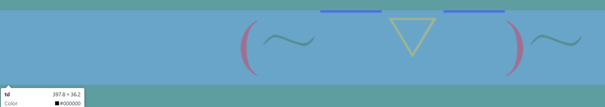
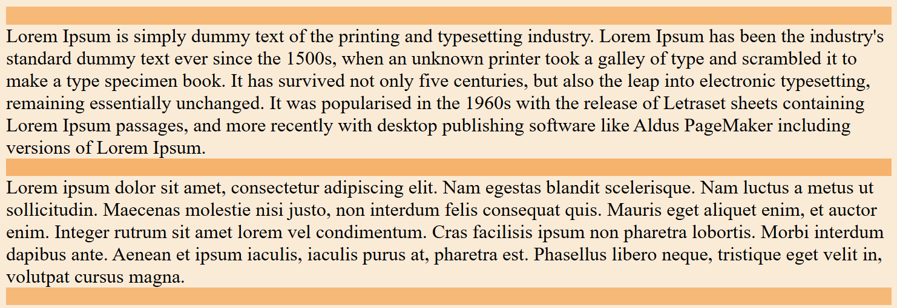
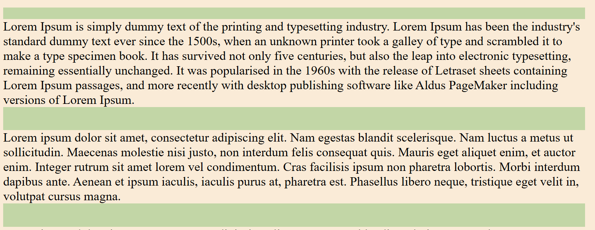

# web_courses_cmc_2025
Some courses of web technologies from master cmc msu

## Табличная вёрстка

> [!INFO]
>
> **Забавное наблюдение №1.**
>
> 
> 1. Если в `td` содержится элемент фиксированного размера в данном случае `img` с `height=2rem`, что составляет `32` , то `height` у `td` будет не `32` а нечто большие, в данном случае `36.2`, это можно исправить за счёт добавления свойства `vertical-align: middle;` к `img`.
> 2. Но не так всё просто) Если у элемента внутри `td` не задан `margin`, то всё снова ломается опять , но уже с другим значением `36.38` - решение простое: фиксируем `height=2rem` у `td`. Если же у `img` будет задан `margin`, то фиксировать `height` у `td` не обязательно.

> [!INFO]
>
> **Забавное наблюдение №2.**
>
> Внутри одного `td` элементы делают `mergin` с перекрытием, а не последовательно, см. рисунки ниже.
>   В качестве решения - заменяем у элементов `mergin` на `padding`.

## Блочная вёрстка

> [!INFO]
>
> **Забавное наблюдение №1.**
>
> 
> Не забываем ставить у элементов, которые должны занимать всю предоставленную площадь `height=100%` или `weight=100%` иначе "умная" `flex` разметка сожмёт элемент по размеру контента и в итоге придётся искать, где потерялись сотые доли размеров. Полезно ещё свойство `flex-shrink`. На рисунке правильный размер табличной вёрстки, а в блочной было ровно `84`, до момента установки `height: 100%;` родительскому по отношению к рассматриваемому.