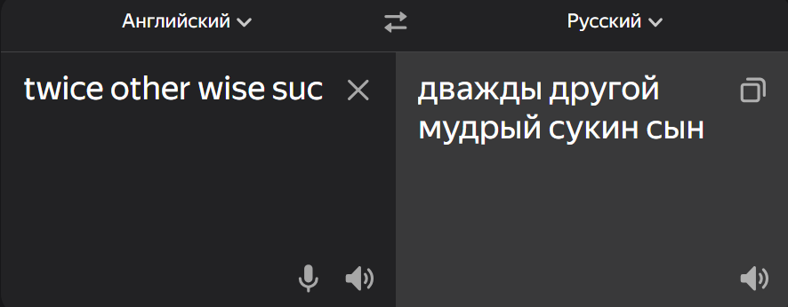

# Haskell


```text
Ну что ж, поехали...
```

```text
Язык ленивый и я тоже 🥲
```


> "Haskell он умный, его математики писали, он сам всё умеет!"
> 
> `© Г. Н. В. 2025`


> "Экзамен будет на листочках..."
> `© Г. Н. В. 2025`




## Полезные ресурсы

- [Ссылка на учебник](https://learnhaskellforgood.narod.ru/learnyouahaskell.com/types-and-typeclasses.html)
- [Ссылка на онлайн компилятор](https://learnhaskellforgood.narod.ru/learnyouahaskell.com/types-and-typeclasses.html)

## Установка компилятора 

- [Оффициальный сайт Haskell](https://www.haskell.org/downloads/)

```text
[В разработке...]
```

## Компиляция и запуск

`ghc {program_name}` - компиляция в исполняемый файл.
- `./{program_name}.exe` - для запуска в `Windows`;
- `./{program_name}` - для запуска в `Linux`.

`ghci {program_name}` - запуск интерпретатора.

## Прочее

### Интерпретатор

- Можно писать модули и подключать их непосредственно в `ghci`, для этого требуется использовать `:l`, например, `:l ex1`. После внесения изменений в модуль, его необходимо загрузить повторно. Можно повторно загрузить ранее загруженные модули через `:r`.

- Через `let` можно инициализировать переменные в интерпретаторе, например, `let a = 5`.

### Списки

> В Haskell списки – это **гомогенные** структуры данных, т.е. содержат несколько элементов одного типа. 🤨

- **Объединение (добавление в конец)** двух списков: `++`

    Пример: `['w','o'] ++ ['o','t']`.

- **Добавление в начало** списка: `:` == `cons`

    Пример: `5:[1,2,3,4,5]`.

- **Извлечение элемента по индексу**: `!!`

    Пример: `[9.4,33.2,96.2,11.2,23.25] !! 1`.


- **Головной элемент** списка: `head`

    Пример: `head [5,4,3,2,1]`.

- **Хвост** списка (отрезает голову списка): `tail`

    Пример: `tail [5,4,3,2,1]`.

- **Последний элемент** списка: `last`

    Пример: `last [5,4,3,2,1]`.

- **Список без его последнего элемента**: `init`

    Пример: `init [5,4,3,2,1]`.

- **Длина списка**: `length`

    Пример: `length [5,4,3,2,1]`

- **Проверка списка на пустоту**: `null`

    Пример: `null [1,2,3]`.

- **Перевернуть список**: `reverse`

    Пример: `reverse [5,4,3,2,1]`.

- **Извлечение n элементов из начала** списка: `take`

    Пример: `take 3 [5,4,3,2,1]`.

- **Отрезать n элементов с начала** списка: `drop`

    Пример: `drop 3 [8,4,2,1,5,6]`.

- **Максимальный/минимальный элемнет** списка: `maximum`/`minimum`

    Пример: `minimum [8,4,2,1,5,6]`.


- **Сумма элементов** списка: `sum`

    Пример: `sum [5,2,1,6,3,2,5,7]`.


- **Произведение элементов** списка: `product`

    Пример: `product [6,2,1,2]`.

- **Проверка на первое вхождение элемента** в список: `elem`

    Пример: 4 \` elem \` [3,4,5,6].


> [!IMPORTANT]
>
> `[], [[]] and[[],[],[]]` — разные типы. Первое – это пустой список, второе – список, содержащий один пустой список, а третье – список, содержащий три пустых списка.

### Типы

- **Просмотр типа**: `:t`

    Пример: `:t zip`