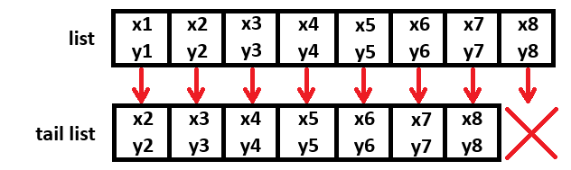

# Практическое задание №2

## Постановка

> 1. Реализовать функции `sum`, `minimum`, `maximum`, `map` и `filter` через какую-либо свертку (подумать, какая будет удобнее).

> 2. Создать бесконечный список степеней двойки `pow2` с помощью генератора списков и с помощью функции-генератора.

> 3. С помощью генератора списков создать список пар взаимно простых чисел в пределах 20 (числа взаимно простые, если ни одно из них не делится на другое). Первое число каждой пары должно быть меньше второго числа.

> 4. Точка на плоскости задается как кортеж из двух вещественных чисел `(Float, Float)`. Ломаная задана последовательным списком точек-вершин. Вычислить длину ломаной с помощью функционалов (расстояние между парой соседних точек удобно считать с использованием `zipWith`).

> 5. Описать генерацию бесконечного списка коэффициентов разложения функции `exp` в ряд Тейлора (ряд Маклорена):
> $$e^x = 1 + \frac{x}{1!} + \frac{x^2}{2!} + \frac{x^3}{3!} + \cdots + \frac{x^n}{n!} = \sum_{n=0}^{\inf}\frac{x^n}{n}, x \in \mathbb{C}$$
> Использовать этот список коэффициентов для вычисления значения экспоненты в точке х с использованием первых n коэффициентов этого ряда (х и n – аргументы функции).

## Выполнение

| № | Статус готовности | Дата выполнения | Дата отправки| Статус сдачи |
| --- | --- | --- | --- | --- |
| 1 | ✅ | 22.09.25 | 23.09.25 | ✅ |
| 2 | ✅ | 21.09.25 | 23.09.25 | ✅ |
| 3 | ✅ | 22.09.25 | 23.09.25 | ✅ |
| 4 | ✅ | 22.09.25 | 23.09.25 | ✅ |
| 5 | ✅ | 21.09.25 | 23.09.25 | ✅ |

> `ex_all.hs` - файл-компиляция всех файлов.

## Прочее

### Идея для №4

Заметим, что при $n$ точках имеется $(n-1)$ отрезок.
Например, $a\rightarrow b \rightarrow c \rightarrow d$.
Поэтому можно воспользоваться функцией `zipWith`, которой в качестве аргументов будут переданы:
-  `f` - функция для расчёта дистанции между двумя точками;
- `l` - список всех точек;
- `(tail l)` - хвост исходного списка, т.е. на 1 элемент меньше.
Тогда получится (см. рисунок ниже), что все расстояния между соседними точками будут верно посчитаны через `f` и так для каждой пары, но у последнего элемента пары нет, поэтому он будет отброшен.

