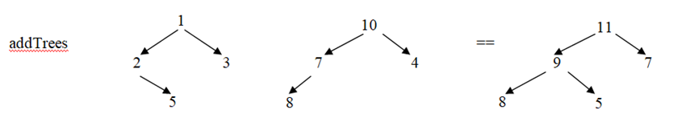
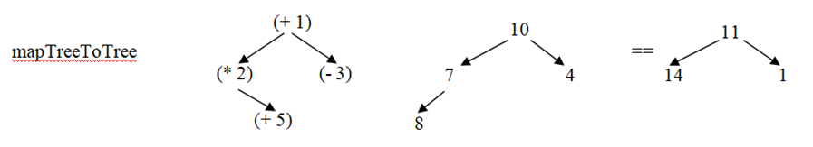

# Практическое задание №3

## Постановка

> `data Tree a = Empty | Node a (Tree a) (Tree a) deriving Show`

> 1. Написать подключение этого типа к классу Eq (реализацию = =).

> 2. Написать полиморфную функцию сложения двух деревьев addTrees
>
> `addTrees ∷ Tree a → Tree a → Tree a`
>   
> В результирующем дереве вершина должна содержать сумму соответствующих вершин исходных деревьев. В результирующем дереве вершина должна быть в том случае, если есть соответствующая ей вершина хотя бы в одном из исходных деревьев (для отсутствующей вершины можно считать её значение равным нулю).
> 

> 3. Написать полиморфную функцию применения дерева функций к дереву значений
>
> `mapTreeToTree ∷ Tree (a → b) → Tree a → Tree b`
>
> В результирующем дереве вершина должна быть только в том случае, если соответствующие вершины есть в обоих исходных деревьях.
> 

> 4. Опишите тип полиморфного стека Stack a. Опишите операции для работы со стеком (проверка на пустоту, добавление нового значения на верхушку стека, получение лежащего на верхушке стека значения, выталкивание лежащего на верхушке значения из стека). Подсоедините описанный тип к классам Functor (fmap) и Eq (= =).

## Выполнение

| № | Статус готовности | Дата выполнения | Дата отправки| Статус сдачи |
| --- | --- | --- | --- | --- |
| 1 | ✅ | 03.10.25 | 03.10.25 | ✅ |
| 2 | ✅ | 03.10.25 | 03.10.25 | ✅ |
| 3 | ✅ | 03.10.25 | 03.10.25 | ✅ |
| 4 | ✅ | 03.10.25 | 03.10.25 | ✅ |

> `ex_all.hs` - файл-компиляция всех файлов.
