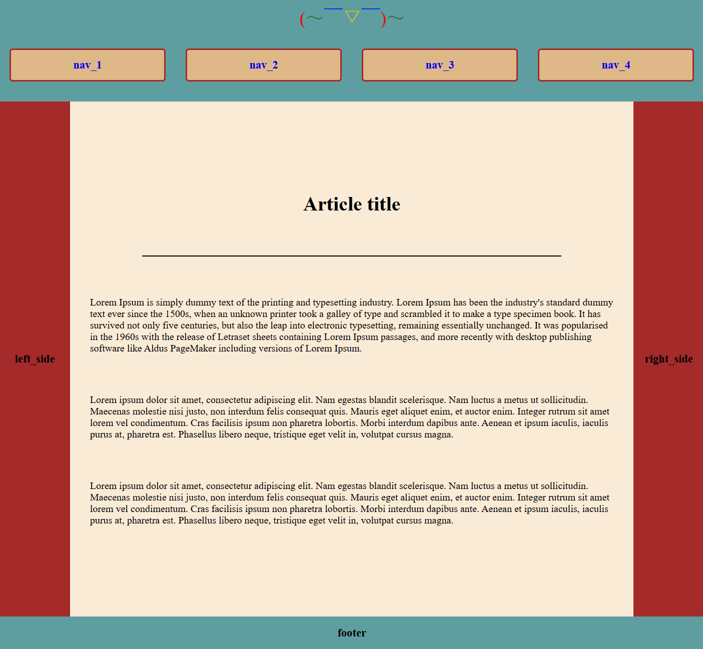
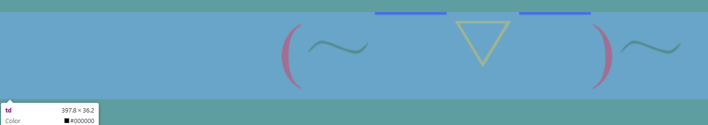
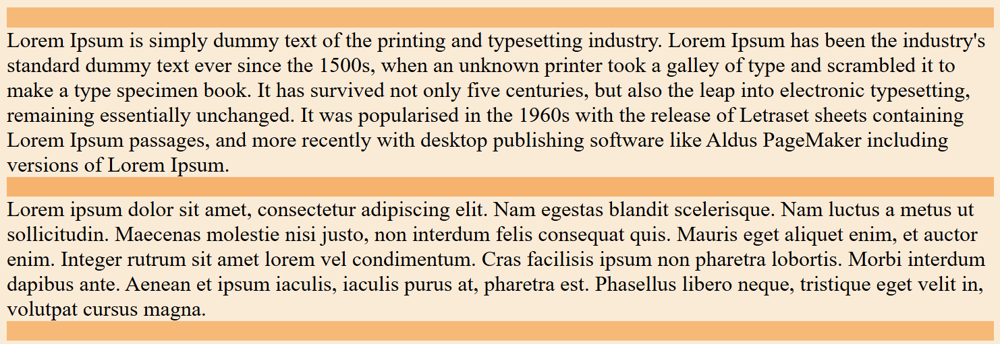
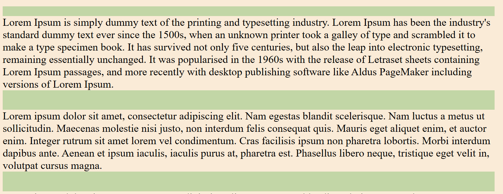

# Практическое задание №1

## Статус

| Этапы | Статус| Дата |
| --- | --- | --- |
| Приступил к работе | ✅ | 03.09.25 |
| Выполнено | ✅ | 10.09.25 |
| Сдано | ❌ |  - |
| **Оценка** | ❌ | - |

## Постановка

```txt
Придумать простейшую верстку в 5-6 областей. Выполнить
эту верстку в табличном стиле и в стиле по слоям (только
верстку, ссылки не должны вести на другие страницы этого
сайта). Обе верстки должны быть идентичными, т.е.
максимально совпадать при наложении. Примеры дизайнов
с прошлых лет приведены ниже.
```

## Критерии

- Страница должна быть «резиновой» - если внешний вид
страницы не изменяется при изменении ширины окна: -1
балл.
- Области должны быть разного цвета, чтобы их граница
была различима.
- Стили верстки слоями не должны имитировать теги таблиц.


## Выполненная вёрстка

Так выглядит простейшая вёрстка (`table.html` и `block.html`), удовлетворяющая заданию.


## Табличная вёрстка

> [!IMPORTANT]
>
> **Забавное наблюдение №1.**
>
> 
> 1. Если в `td` содержится элемент фиксированного размера в данном случае `img` с `height=2rem`, что составляет `32` ![alt textreadme_imgs/image-2.png), то `height` у `td` будет не `32` а нечто большие, в данном случае `36.2`, это можно исправить за счёт добавления свойства `vertical-align: middle;` к `img`.
> 2. Но не так всё просто) Если у элемента внутри `td` не задан `margin`, то всё снова ломается опять , но уже с другим значением `36.38` - решение простое: фиксируем `height=2rem` у `td`. Если же у `img` будет задан `margin`, то фиксировать `height` у `td` не обязательно.


> [!IMPORTANT]
>
> **Забавное наблюдение №2.**
>
> Внутри одного `td` элементы делают `mergin` с перекрытием, а не последовательно, см. рисунки ниже.
>   В качестве решения - заменяем у элементов `mergin` на `padding`.


## Блочная вёрстка

> [!IMPORTANT]
>
> **Забавное наблюдение №1.**
>
> 
> Не забываем ставить у элементов, которые должны занимать всю предоставленную площадь `height=100%` или `weight=100%` иначе "умная" `flex` разметка сожмёт элемент по размеру контента и в итоге придётся искать, где потерялись сотые доли размеров. Полезно ещё свойство `flex-shrink`. На рисунке правильный размер табличной вёрстки, а в блочной было ровно `84`, до момента установки `height: 100%;` родительскому блоку по отношению к рассматриваемому.